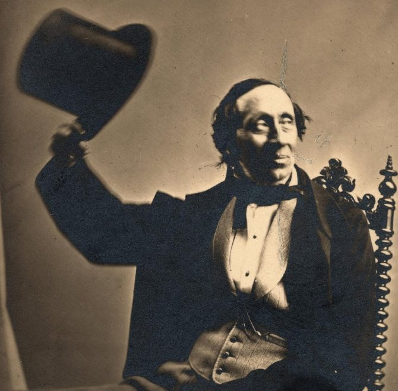

# Ганс Христиан Андерсен

 Родился 2 апреля 1805 года в Оденсе на датском острове Фюн. Учился в школе в городке Слагельсе, а затем в другой школе в Эльсиноре. Играл в Королевском театре  второстепенные роли.

- автор всемирно известных сказок для детей и взрослых
- написал 3342 произведения
- переведены на примерно 125 языков
- представляют собой незыблемые уроки добродетели и жизненной стойкости

